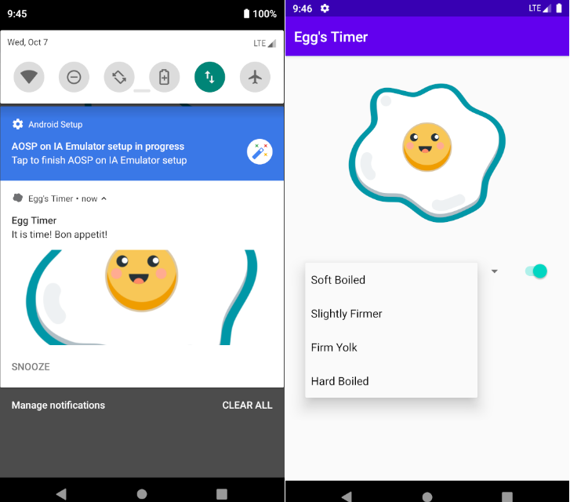

# EggsTimer
Timer App for cooking eggs. You can start and stop the 🥚 timer, choose different cooking intervals.

**Egg's Timer** uses ***Android Notifications*** to deliver timely material about 🥚 cooking, which has the option to be snoozed for another minute.
Clicking on a notification takes the user to a view in the app's related notification content.

The App also handles ***Firebase Cloud Messaging*** cross-platform cloud to push notifications and transfer data to all users.
